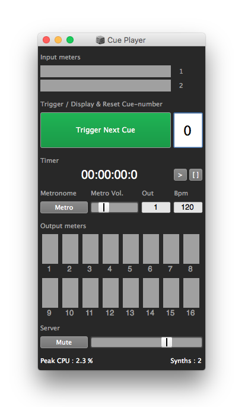

#CuePlayer 

[|> project page <|](http://fasmatwist.com/opensource/)

CuePlayer is a tool for composing and performing real-time and mixed electronic works using the SuperCollider language. It helps a composer to organise processes and musical material in bundles (cues) and execute them when needed during the course of a piece. It is particularly applicable to musical works incorporating real-time electronics and acoustic instruments; it may also be handy in any scenario where the composer wishes to organise, schedule and trigger bundles of processes.

Install it as a quark from within SuperCollider, via:

    Quarks.gui;

or download it from [GitHub](https://github.com/dathinaios/cueplayer/archive/0.1.0.zip), unzip & and place the folder in:

    ~/Library/Application Support/SuperCollider/Extensions/

